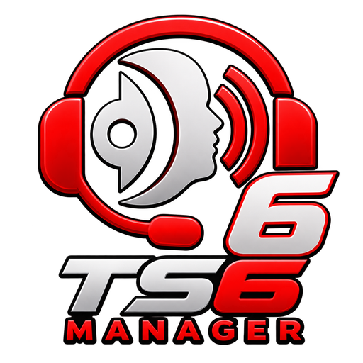

#### DISCLAIMER: 

This is a fork of clusterzx/ts6-manager



# TS6 Manager

Web-based management interface for TeamSpeak servers. Control virtual servers, channels, clients, permissions, music bots, automated workflows, and embeddable server widgets — all from your browser.

Built on the **WebQuery HTTP API** (the ServerQuery replacement in modern TeamSpeak builds). Telnet is not used or supported.


## Screenshots

<details>
<summary><b>Dashboard, music bots, the visual bot flow editor, and ready-made flow templates</b> — click to expand</summary>

### Dashboard
Live overview of your server: online users, channel count, uptime, ping, bandwidth graph, and server capacity at a glance.


### Music Bots
Run multiple music bots per server. Each bot has its own queue, volume control, and playback state. Supports radio streams, YouTube, and a local music library. Users in the bot's channel can control it via text commands (`!radio`, `!play`, `!vol`, etc.).


### Bot Flow Engine
Visual node-based editor for building automated server workflows. Drag triggers, conditions, and actions onto the canvas, connect them, and deploy. Supports TS3 events, cron schedules, webhooks, and chat commands as triggers.


### Flow Templates
Get started quickly with pre-built flow templates. Covers common use cases like temporary channel creation, AFK movers, idle kickers, online counters, and group protection. One click to import, then customize to your needs.


</details>

## Why This Fork Exists

Upstream had a persistent video/audio streaming stutter that was never resolved, plus a pile of security findings nobody had triaged. This fork root-caused and fixed the streaming stutter, did a full security-hardening pass, and has since grown a considerable number of its own features and upstream-requested fixes on top.

**See [CHANGELOG.md](CHANGELOG.md)** for the full history — a short summary of the headline changes, followed by every individual change in the order it shipped.

## Requirements

**On your machine:**

- **Docker** with the Compose plugin — that's all. ffmpeg, yt-dlp and everything else the backend needs is already baked into the images

**On your TeamSpeak server** — which does not have to be the same machine:

- **WebQuery HTTP enabled** (not raw/telnet). It is off by default on TeamSpeak 6, and how you enable it depends on how your server runs: `query_protocols` has to include `http`, set either in `tsserver.yaml`, as a command-line flag, or — for the official Docker image — via `TSSERVER_QUERY_HTTP_ENABLED=1`. If you rent your server, your host may have to enable it for you
- **A WebQuery API key.** Your server prints a `serveradmin` key once, on its first-ever startup; otherwise generate one with `apikeyadd`
- **Network access to the query port** (`query_http_port`, default `10080`) from wherever this manager runs, and the server's query IP allowlist has to include the address it connects from. TeamSpeak's own documentation explicitly recommends adding a web administration interface's IP there. If the two run on separate machines that means the manager's outbound address — and you should restrict who can reach that port rather than exposing it openly. See [Getting Started](https://github.com/DomeNinchen/ts6forkmanager/wiki/Getting-Started)

**Only if you want the matching feature:**

- **SSH ServerQuery** on your TeamSpeak server — needed exclusively for bot flows triggered by server events (a client joining, leaving, moving). Everything else, including scheduled and webhook-triggered flows, runs over WebQuery alone
- **UDP `50000-50100` open on the host** — needed exclusively for video streaming. That traffic cannot pass through an HTTP reverse proxy and needs its own firewall rule

## Quick Start (Docker)

1. Download the [`docker-compose.yml`](docker-compose.yml)
2. Create a `.env` file next to it:

```env
JWT_SECRET=your-random-secret-at-least-32-characters
ENCRYPTION_KEY=another-random-secret-for-credential-encryption
```

Generate secure values:

```bash
echo "JWT_SECRET=$(openssl rand -base64 32)" >> .env
echo "ENCRYPTION_KEY=$(openssl rand -base64 32)" >> .env
```

3. Start the stack:

```bash
docker compose up -d
```

4. Open `http://localhost:3000/setup` and create your admin account
5. Log in, then add your TeamSpeak server connection under **Settings → Connections** (host, WebQuery port, API key)

> `JWT_SECRET` is **required** — the backend will refuse to start in production without it.
> `ENCRYPTION_KEY` is optional but recommended — if not set, `JWT_SECRET` is used as fallback for credential encryption.

Running it behind a reverse proxy, or on Coolify? See [Deployment](https://github.com/DomeNinchen/ts6forkmanager/wiki/Deployment). Every other environment variable is listed in [Configuration](https://github.com/DomeNinchen/ts6forkmanager/wiki/Configuration).

## Features

**Server management** — dashboard with live stats and a bandwidth graph, virtual server control, channel tree with drag-and-drop, client list with bulk actions, bans, complaints, offline messages, file browser, log viewer, snapshots, and per-server advanced settings.

**Permissions** — a full editor across all five permission layers, including offline clients. Bulk-apply to many entities at once, compare several side by side with automatic highlighting, look up where a permission is set anywhere on the server, and see every permission that applies to one client in one channel with the layer it comes from. → [Wiki](https://github.com/DomeNinchen/ts6forkmanager/wiki/Permissions)

**Groups** — server and channel group management with member handling, bulk selection, and export/import between servers.

**Music bots** — multiple bots per server with independent queues, radio streaming, YouTube via yt-dlp, a media library with playlists, and in-channel text commands. → [Wiki](https://github.com/DomeNinchen/ts6forkmanager/wiki/Music-Bots)

**Video streaming** — WebRTC streaming from YouTube, Twitch, direct URLs or your library into a TeamSpeak channel, with quality presets, an in-browser preview and a live viewer list.

**Bot flows** — a visual editor for automation. Triggers from TeamSpeak events, cron schedules, webhooks and chat commands; actions covering kick/ban/move/message, channel management, HTTP requests and WebQuery commands; plus conditions, variables, loops and a placeholder system. Ships with ready-made templates. → [Wiki](https://github.com/DomeNinchen/ts6forkmanager/wiki/Bot-Flows)

**Server widgets** — embeddable status banners for websites and forums, as a live page, SVG or PNG, with public token-based access.

**Security** — role-based access control with four roles and per-server scoping, two-factor authentication with recovery codes, Single Sign-On via any OpenID Connect provider, AES-256-GCM encryption for stored credentials, JWT with refresh-token rotation, SSRF protection, and rate limiting. → [Wiki](https://github.com/DomeNinchen/ts6forkmanager/wiki/Users-and-Roles)

**Administration** — theming, user and session management, yt-dlp cookie handling, runtime debug toggles, scheduled restarts, and an update status page.

## 📖 Documentation

**The [Wiki](https://github.com/DomeNinchen/ts6forkmanager/wiki) is the full documentation** — how to use each feature, how to configure and deploy it, and the things that are easy to get wrong.

| | |
|---|---|
| [Getting Started](https://github.com/DomeNinchen/ts6forkmanager/wiki/Getting-Started) | Connecting your TeamSpeak server, and what WebQuery vs. SSH is actually for |
| [Permissions](https://github.com/DomeNinchen/ts6forkmanager/wiki/Permissions) | The five layers, which one wins, and the tools for working with them |
| [Tips and Pitfalls](https://github.com/DomeNinchen/ts6forkmanager/wiki/Tips-and-Pitfalls) | Behaviour that looks like a bug but isn't. Worth reading early |
| [Configuration](https://github.com/DomeNinchen/ts6forkmanager/wiki/Configuration) | Every environment variable, for backend and sidecar |
| [Deployment](https://github.com/DomeNinchen/ts6forkmanager/wiki/Deployment) | Reverse proxies, Coolify, backups |
| [Development](https://github.com/DomeNinchen/ts6forkmanager/wiki/Development) | Architecture, tech stack, running it from source |

## Known Issues (Upstream TS6 Server Bug)

- **Music bot avatar only visible to TS6 clients, not TS3** ([teamspeak/teamspeak6-server#122](https://github.com/teamspeak/teamspeak6-server/issues/122)): an avatar uploaded while connected shows correctly to other TS6 clients, but a TS3 client viewing the same connection gets stuck on "Loading Image" forever. Confirmed this is server-side, not about which client (or bot) does the uploading, with a real, isolated test against a real TS6 server — including a control test using the *official TS6 client itself* (not just this fork's code): the *same* official TS6 client produces a TS3-compatible avatar when connected to an (old) TS3 server, but not when connected to a TS6 server. Matches TeamSpeak's own previously-reported [avatar "convert error"](https://community.teamspeak.com/t/avatar-cannot-be-set-convert-error/60941) thread. Can't be fixed from this fork's side; needs a TeamSpeak server fix.

The music bot description template was affected by a similar-looking issue (`clientupdate client_description=...` rejected outright) — turned out to be this fork using the wrong ServerQuery command rather than a TS6 bug: `client_description` is only documented as a `clientedit` (ServerQuery, edit-from-outside) parameter, not a `clientupdate` (self, over the bot's own voice connection) one. Fixed by pushing the description via `clientedit` over the existing WebQuery connection instead.

## License

MIT
