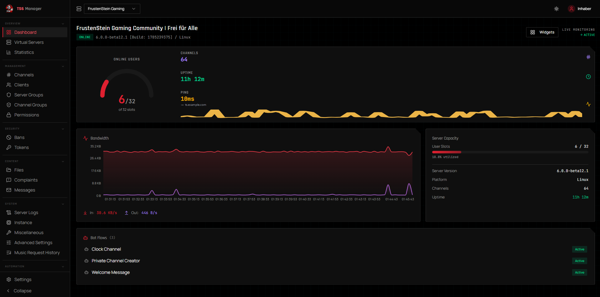
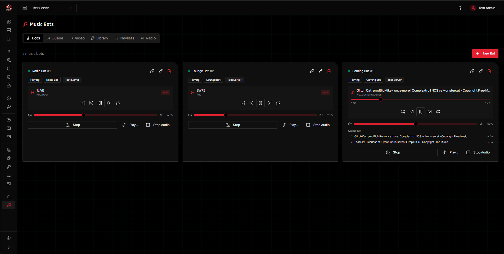
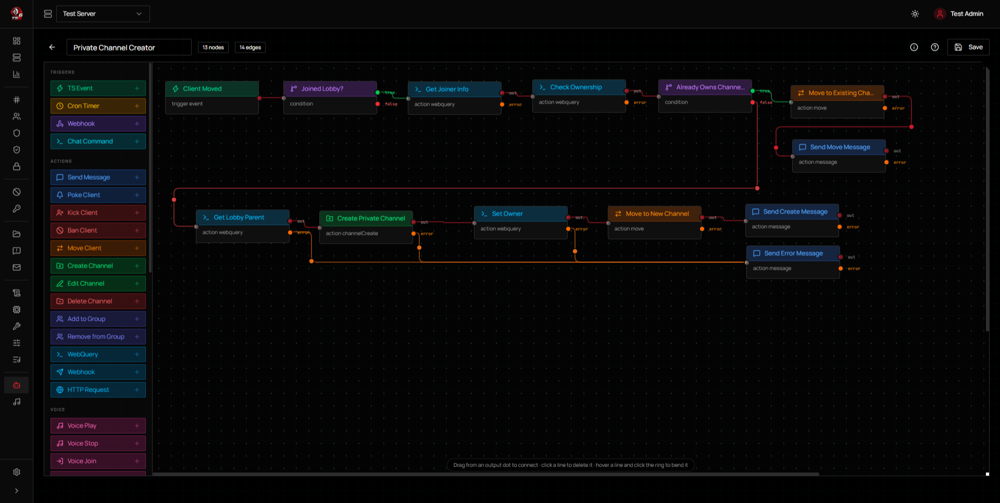
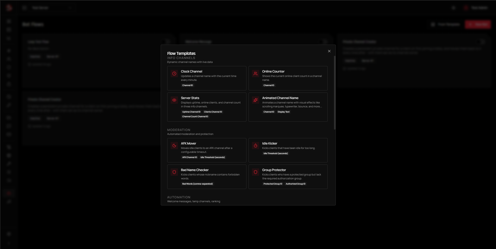

#### DISCLAIMER: 

This is a fork of clusterzx/ts6-manager

# TS6 Manager

Web-based management interface for TeamSpeak servers. Control virtual servers, channels, clients, permissions, music bots, automated workflows, and embeddable server widgets — all from your browser.

Built on the **WebQuery HTTP API** (the ServerQuery replacement in modern TeamSpeak builds). Telnet is not used or supported.


## What This Fork Changes

This fork exists because upstream had a persistent video/audio streaming stutter that was never resolved, plus a pile of security findings nobody had triaged. Here's what's different:

### Video Streaming: Stutter Fixed, Quality Improved
- Root-caused and fixed the stutter — three separate issues: a missing shared volume between the backend and the sidecar container, a single bad RTP timestamp poisoning the adaptive A/V-sync estimate, and VP8 encoding that ran effectively single-threaded regardless of available CPU cores
- Videos are pre-downloaded and streamed from disk instead of feeding ffmpeg a live, rate-limited CDN URL — real HD quality instead of whatever single combined format YouTube happens to offer live (often capped at 360p, or not offered at all). Ported from [uniskela/ts6-manager](https://github.com/uniskela/ts6-manager), itself adapted from [uniplayer1/ts6-manager](https://github.com/uniplayer1/ts6-manager) — credit where it's due
- Multi-threaded VP8 encoding tuned for quality-per-bit, with a rate-control buffer that scales to the target bitrate
- A/V sync pacing is clamped so a single bad timestamp can't stall playback or overflow the RTP queues
- Streams auto-stop when a clip ends instead of looping forever; added a mute/unmute toggle to the in-browser preview

### Security
- [clusterzx/ts6-manager#80](https://github.com/clusterzx/ts6-manager/issues/80) pointed out that a Trivy scan against upstream turned up critical, never-triaged findings — ran the same scan here and fixed what it found (a Go WebRTC dependency chain with 8 critical advisories, multer DoS CVEs, and others)
- Dependabot enabled, plus a manual, on-demand Trivy workflow scanning both the source tree and all three built Docker images
- Branch protection enabled on `main`
- Fixed a real injection surface in the bot flow engine: condition expressions were run through raw string substitution before evaluation, so a crafted chat message could alter what the expression actually checked instead of just being compared as data

### Reliability
- Fixed a Docker signal-handling bug: the backend's `CMD` ran node as a child of a shell (`sh -c "... && node ..."`), so `SIGTERM` on container restart never reached node — it hung for the full shutdown grace period and then got hard-killed, leaving the old SSH query session and music bot connection registered on the TeamSpeak server until *it* eventually timed them out (surfacing as `nickname already in use` / `already member of channel` errors on the next start). Fixed by `exec`-ing into node so it becomes PID 1 and receives the signal directly — restarts now disconnect cleanly and immediately, and the music bot reconnects on its own right after.
- That fix alone wasn't enough: the SSH query client's own `destroy()` call started closing the connection but never waited for it to actually finish before the process exited, so a fast restart could still occasionally race a fresh login against the still-registered old session. Now properly awaits the real SSH close event before shutdown proceeds.
- Also closed a narrower reentrancy gap where a reconnect attempt already in flight at the exact moment of a restart could end up acting on a connection that was simultaneously being torn down.

### Feature Requests & Fixes from Upstream
- [clusterzx/ts6-manager#77](https://github.com/clusterzx/ts6-manager/issues/77) asked for adding/removing clients from server groups directly in the UI — the backend and API layer already supported it, just needed the UI: a searchable "Add Member" dialog and a remove button per member on the Server Groups page
- [clusterzx/ts6-manager#57](https://github.com/clusterzx/ts6-manager/issues/57) asked for a way to clear the music queue — already covered here by the dedicated Queue tab on the Music Bots page (clear button, per-item remove, reorder, click-to-play)
- [clusterzx/ts6-manager#39](https://github.com/clusterzx/ts6-manager/pull/39) by [s3bul](https://github.com/s3bul) fixed music chat commands breaking when TeamSpeak auto-wraps links in BBCode (`[URL]...[/URL]`) — adapted here to strip the wrapper once for every command that takes a raw URL, which in this fork is `!play`, `!queue`, and `!stream` (upstream only has the first two)
- [clusterzx/ts6-manager#66](https://github.com/clusterzx/ts6-manager/pull/66) by [ValiOff8](https://github.com/ValiOff8) added the bot's numeric ID next to its name on the Music Bots overview cards — useful when a bot flow's voice-action node needs to reference a specific bot by ID
- [clusterzx/ts6-manager#37](https://github.com/clusterzx/ts6-manager/issues/37) reported that "Test Connection" in Settings always showed success — the backend was already returning a real result, but the UI only checked whether the HTTP request itself succeeded, not the `success` field in the response body. Now checks the actual result and, since the backend also now passes through the real failure reason (e.g. `connect ECONNREFUSED ...`, or the TeamSpeak API's own error message), shows *why* it failed, not just that it did
- [clusterzx/ts6-manager#54](https://github.com/clusterzx/ts6-manager/issues/54) reported an "Unknown escape" error crashing a music bot into its error state — the music-bot protocol parser threw on any TeamSpeak escape sequence it didn't recognize instead of passing it through unchanged, unlike the (correct) SSH/EventBridge-side parser. Now lenient the same way; an unrecognized escape no longer takes the bot down
- [clusterzx/ts6-manager#78](https://github.com/clusterzx/ts6-manager/issues/78) reported that editing a connection's SSH settings has no effect until the connection happens to drop on its own — the code that maintains the SSH-based event/command listeners simply does nothing if one is already open for that server, so it kept running on the old credentials. Editing host/SSH port/username/password now force-reconnects it with the new ones immediately
- [clusterzx/ts6-manager#50](https://github.com/clusterzx/ts6-manager/issues/50) reported that two near-simultaneous token-refresh requests could crash with an unhandled "record not found" error — the rotation logic read, then unconditionally updated and deleted the old token, so a second request racing on the same token could act on a row the first had already removed. It now atomically claims the token first (only one request can win); the loser gets a clean, expected "already used" error instead of a crash
- [clusterzx/ts6-manager#82](https://github.com/clusterzx/ts6-manager/issues/82) pointed out that yt-dlp only ever gets newer on an image rebuild, but YouTube extraction breaks on its own schedule as the site changes, independent of that. The backend container now checks for a yt-dlp update on every start (non-fatal if offline/PyPI is unreachable — verified it gives up after ~12s of retries rather than blocking startup)
- Fixed a bug present in upstream too: the Edit Connection dialog's Update button stayed disabled until a new API key was entered, even though leaving it blank correctly means "keep the existing key" server-side — you couldn't save an edit (e.g. changing SSH credentials) without also re-entering the API key. Now only required when adding a new connection
- [clusterzx/ts6-manager#63](https://github.com/clusterzx/ts6-manager/issues/63) asked for the AFK Mover action to support exempt channel IDs, the same way it already supports exempt group IDs (e.g. a lobby/waiting room where clients should never get auto-moved). Added an "Exempt Channel IDs" field alongside the existing one
- [clusterzx/ts6-manager#46](https://github.com/clusterzx/ts6-manager/issues/46) asked for a command trigger's arguments to be individually addressable instead of one raw string, e.g. `!mute user123 10m spam` → target/duration/reason instead of a single blob you'd have to split yourself in a Condition node. A command trigger's event data now also includes `command_args_list` (indexed, e.g. `{{event.command_args_list.0}}`) and `command_args_length`, alongside the original `command_args` string (kept as-is so existing flows that already use it directly aren't affected)
- [clusterzx/ts6-manager#38](https://github.com/clusterzx/ts6-manager/issues/38) asked for a way to filter the Permissions page down to just the permissions actually set on the selected entity, instead of scrolling past every possible permission most of which are unset. Added an "Only show set" toggle next to the search field
- `!play`, `!queue`, and `!stream` now also accept search terms instead of only a direct URL (e.g. `!play imagine dragons believer`, `!stream some movie title 720p`) — resolved via yt-dlp's own search syntax, so it works the same as a real link, no separate search step or extra UI needed. `!stream`'s optional quality-preset suffix still works alongside a multi-word search query (only the last word is treated as a preset, and only if it's actually one of 480p/720p/1080p)
- `!stop` no longer claims "Playback stopped." when nothing was actually playing (e.g. only a video stream was active — that's stopped separately via `!stopstream`, which `!stop` intentionally doesn't touch)
- [clusterzx/ts6-manager#79](https://github.com/clusterzx/ts6-manager/issues/79) asked for songs already sitting in the music folder (e.g. a volume shared with another app) to show up in the library without a manual upload or YouTube download. Added a "Scan for New Files" button on the Music Bots Library tab, plus the same scan automatically on backend startup — both skip files already known to the library, so re-running is safe
- [clusterzx/ts6-manager#33](https://github.com/clusterzx/ts6-manager/issues/33) — titled "Video Random Playlist" but the actual ask was picking a video already on disk instead of typing its filename or a URL. The Video Stream tab now lists video files already sitting in the music folder and lets you pick one directly as the stream source
- Extended the above: since there was no way to get a video file into the shared folder short of `docker cp`-ing it in by hand, the Library tab now also accepts video uploads (not just audio), with an All/Audio/Video filter to browse either. New uploads and downloads are organized into `music/`/`video/` subfolders (files from before this existed are still found via scan/the stream picker, for backward compatibility)
- Fixed a side effect of the scan feature above: `!play`/`!queue`/`!stream` cache their YouTube download as a bare `<video-id>.<ext>` and never registered it as a library entry, so scan had nothing but the id itself to title it with, showing up as e.g. `zRe4dY4202s` instead of the actual song name. The on-demand "Scan for New Files" button now looks the real title up for these instead, and also fixes any such entry an earlier scan already added under its raw id; the automatic startup scan stays offline/fast and just leaves them for the next manual scan
- The Library list now shows a small "Refreshing..." spinner next to its header while it's updating in the background (e.g. right after a scan or upload finishes) - the list was always refreshing itself automatically, this just makes it visible instead of looking like nothing happened for a moment
- [clusterzx/ts6-manager#58](https://github.com/clusterzx/ts6-manager/issues/58) (partially - bot ID display was already covered by PR #55/#66): SQLite's id counter for a table never resets on its own even after deleting every row, so a re-added radio station or music bot keeps climbing instead of starting back at 1. Settings → Debug now has a "Danger Zone" with a "Reset Radio Station IDs" / "Reset Music Bot IDs" button each, which (as disclaimed in the UI) wipes that table across every server to actually reset the counter, then the next one created starts at #1 again. Radio stations also now show their numeric id next to their name, same as music bots already did
- [clusterzx/ts6-manager#55](https://github.com/clusterzx/ts6-manager/issues/55): a new Settings → Restart tab schedules a periodic restart of ts6-manager's own backend and/or sidecar container (independently selectable, so a setup using only one of the two isn't forced to restart the other) at a configurable time and day-of-week set. This does **not** restart the actual TeamSpeak server - only ts6-manager itself, to clear accumulated connection/bot-manager state or a stuck video-streaming process. Both containers already had a graceful SIGTERM/SIGINT shutdown handler and `restart: unless-stopped`; this just triggers that same shutdown on a schedule instead of only on a real stop/crash
- [clusterzx/ts6-manager#31](https://github.com/clusterzx/ts6-manager/issues/31): the Permissions page's Client picker only ever listed currently-online clients, even though editing by database id already worked for anyone. Added a "Show offline clients" toggle (pulls from the existing but previously-unused-here `clientdblist` query) plus a search box, since a server's full client history can be long — online clients are shown first and marked with a dot
- [clusterzx/ts6-manager#44](https://github.com/clusterzx/ts6-manager/issues/44): `!play`, `!queue`, and `!stream` now also accept a Spotify track link (Spotify doesn't allow third-party apps to actually play through it). The link is resolved to "\<artist> \<title>" via the track's public page — no API key needed — and searched on YouTube the same way a plain-text query already was. Playlist/album links aren't supported, just individual tracks
- A music bot can now be given a custom TS3 avatar and a templated description, editable from the same Create/Edit Music Bot dialog and applied live (no reconnect needed). The description supports placeholders, e.g. `Now playing: {title} ({remaining} left)` — see the Music Bots section under Features below for the full placeholder list. It updates on actual changes (song start/change, queue size, editing the template) rather than polling; a template with a time placeholder like `{remaining}` additionally refreshes every 30s while playing so it keeps counting down, and shows a "-"/"0" idle form when nothing is playing instead of going blank. **⚠️ Both are currently broken by TS6 server bugs, not by this fork** — see [Known Issues](#known-issues-upstream-ts6-server-bugs) below

### Kept Up to Date
Worked through every outdated dependency, easiest to hardest, verifying each with a real container run — not just a successful build — before it shipped:
- Node 20 → 24, Express 4 → 5, Prisma 6 → 7 (backend)
- React 18 → 19, Vite 6 → 8, Tailwind 3 → 4, `react-router-dom` → the unified `react-router` 8, TypeScript 5 → 7, `@tanstack/react-table` 8 → 9 (frontend)
- Removed `zod`, `react-hook-form`, and `@hookform/resolvers` — installed but never actually used anywhere in the codebase

See the [merged pull requests](https://github.com/DomeNinchen/ts6forkmanager/pulls?q=is%3Apr+is%3Amerged) for the full, itemized history of changes.

## Screenshots

### Dashboard
Live overview of your server: online users, channel count, uptime, ping, bandwidth graph, and server capacity at a glance.



### Music Bots
Run multiple music bots per server. Each bot has its own queue, volume control, and playback state. Supports radio streams, YouTube, and a local music library. Users in the bot's channel can control it via text commands (`!radio`, `!play`, `!vol`, etc.).



### Bot Flow Engine
Visual node-based editor for building automated server workflows. Drag triggers, conditions, and actions onto the canvas, connect them, and deploy. Supports TS3 events, cron schedules, webhooks, and chat commands as triggers.



### Flow Templates
Get started quickly with pre-built flow templates. Covers common use cases like temporary channel creation, AFK movers, idle kickers, online counters, and group protection. One click to import, then customize to your needs.



## Features

### Server Management
- Dashboard with live server stats, capacity overview, and a bandwidth graph showing the last ~15 minutes immediately on load (sampled continuously in the background, not just from when the page happens to be open)
- Virtual server list with start/stop controls
- Channel tree with drag-and-drop ordering, including ServerQuery/bot clients (visually distinguished from regular users)
- Client list with kick, ban, move, poke actions
- Server & channel group management, including adding/removing members via a searchable client picker
- Permission editor (server, channel, client, group-level), including offline clients (searchable, not just who's currently connected)
- Ban list management
- Token / privilege key management
- Complaint viewer
- Offline message system
- Server log viewer with filtering
- Channel file browser with upload/download
- Instance-level settings

### Music Bots
- Multiple bots per server, each with independent queue and playback
- Radio station streaming with ICY metadata and live title updates
- YouTube playback via yt-dlp (search, download, queue)
- Media library management: upload audio or video, or scan for files already sitting in the shared music folder (e.g. a volume shared with another app), organized into `music/`/`video/` subfolders, filterable by type and sortable by title/type/duration; playlists
- Queue tab: clear, reorder, remove individual items, click-to-play
- Volume control, pause, skip, previous, shuffle, repeat
- Stereo audio support with stable 20ms pacing
- Auto-reconnect with exponential backoff on disconnect
- In-channel text commands for hands-free control
- Music request history tracking
- Custom avatar (PNG/JPEG/GIF/WebP; size limit is whatever your TS server's own `i_client_max_avatar_filesize` permission allows) and a templated `client_description`, set from the Create/Edit Music Bot dialog and applied live. The description updates whenever something actually changes (song start/change, queue size, editing the template) - plus every ~30s while playing, but only if the template contains a time placeholder like `{remaining}`, so it isn't polled needlessly otherwise. Shows a "-"/"0" idle form when nothing is playing instead of going blank. **⚠️ Currently broken by TS6 server-side bugs (not this fork's code) — see [Known Issues](#known-issues-upstream-ts6-server-bugs)**. Supports:
  - `{title}` — title of the currently playing track
  - `{artist}` — artist, if known (empty string otherwise)
  - `{remaining}` — time left, auto-formatted (`"42 min"`, or `"1h 5min"` past 60 minutes); empty for live streams
  - `{remaining_min}` — time left in plain minutes (whole number); empty for live streams
  - `{elapsed}` — time played so far, formatted the same way as `{remaining}`
  - `{duration}` — total track length, formatted the same way; empty for live streams
  - `{queue_length}` — number of songs still queued after this one

### Video Streaming
- Video streaming from YouTube, Twitch, direct URLs, or an uploaded video already in the library to TeamSpeak channels
- YouTube/Twitch sources are downloaded once (real `bestvideo+bestaudio` merge via yt-dlp) before playback starts, then streamed from disk — this avoids feeding ffmpeg a live, rate-limited CDN URL and gives noticeably better quality than a single pre-muxed format
- WebRTC-based with Go sidecar relay (Pion) for low-latency delivery
- Quality presets (480p, 720p, 1080p)
- In-browser preview with WebRTC playback (with a mute/unmute toggle)
- Live viewer list with per-viewer kick, both in the WebUI and via `!viewers` in chat
- Adaptive A/V pacing based on RTP timestamps vs. wall clock, with a clamp to prevent a single bad timestamp from stalling playback
- Multi-threaded VP8 encoding, scaled to the host's available cores
- Runs as a Docker sidecar container alongside the backend

### Bot Flow Engine
- Visual flow editor with drag-and-drop node canvas
- Triggers: TS3 events, cron schedules, webhooks (with mandatory secrets), chat commands (global or channel-specific)
- Actions: kick, ban, move, message, poke, channel create/edit/delete, HTTP requests, WebQuery commands
- Conditions, variables, delays, loops, logging
- Animated channel names (rotating text on a timer)
- Placeholder system with filters and expressions
- Pre-built templates for common automation tasks

### Server Widgets
- Embeddable server status banner for websites and forums
- Token-based public access (no authentication required)
- Available as live page, SVG, or PNG image
- Dark and light themes
- Configurable: show/hide channel tree and client list

### Security
- Setup wizard for initial admin account (no default credentials)
- AES-256-GCM encryption for stored credentials (API keys, SSH passwords)
- SSRF protection on all outbound HTTP requests and FFmpeg URLs
- Rate limiting on authentication endpoints
- JWT access + refresh token rotation with reuse detection
- Role-based access control (admin / viewer)
- Per-server access control for multi-tenant setups
- WebQuery command whitelist in bot flows (blocks destructive commands)
- Authenticated WebSocket connections
- Password complexity requirements

### Settings & Administration
- yt-dlp cookie file management for accessing age-restricted or member-only YouTube content
- Upload cookies via file or paste directly in the UI
- Admin-only settings panel
- Debug logging toggles (voice bot, Rank Check) switchable at runtime from Settings → Debug — no env var or restart needed
- "Danger Zone" (Settings → Debug) to reset the radio station / music bot id counters, for when SQLite's ever-climbing autoincrement gets annoying after deleting everything and starting over
- Scheduled restart (Settings → Restart) for ts6-manager's own backend and/or sidecar container, on a configurable time and day-of-week — not the TeamSpeak server itself

## Known Issues (Upstream TS6 Server Bugs)

Both of these were confirmed with real, isolated tests against a real TS6 server — including a control test using the *official TS6 client itself* (not just this fork's code) — and reported upstream. They can't be fixed from this fork's side; they need a TeamSpeak server fix.

- **Music bot avatar only visible to TS6 clients, not TS3** ([teamspeak/teamspeak6-server#122](https://github.com/teamspeak/teamspeak6-server/issues/122)): an avatar uploaded while connected shows correctly to other TS6 clients, but a TS3 client viewing the same connection gets stuck on "Loading Image" forever. Confirmed this is server-side, not about which client (or bot) does the uploading: the *same* official TS6 client produces a TS3-compatible avatar when connected to an (old) TS3 server, but not when connected to a TS6 server. Matches TeamSpeak's own previously-reported [avatar "convert error"](https://community.teamspeak.com/t/avatar-cannot-be-set-convert-error/60941) thread.
- **Music bot description template does nothing** ([teamspeak/teamspeak6-server#123](https://github.com/teamspeak/teamspeak6-server/issues/123)): `clientupdate client_description=...` always fails with `error id=1538 msg="invalid parameter"` on TS6, even with the exact permission granted, and regardless of the connecting client's version/platform signature. Other, near-identical properties (`client_nickname`, `client_meta_data`, `client_away_message`) update fine over the same connection — only `client_description` is rejected. Matches an older, staff-acknowledged TeamSpeak report ([client description does not change](https://community.teamspeak.com/t/bug-the-client-description-does-not-change/26215)) that was apparently never actually fixed.

## Architecture

```
┌──────────────┐     ┌──────────────┐     ┌─────────────────┐
│   Frontend   │────▶│   Backend    │────▶│  TS Server      │
│  React SPA   │     │  Express API │     │  WebQuery HTTP  │
│  nginx :80   │     │  Node :3001  │     │  SSH (events)   │
└──────────────┘     └──────┬───────┘     └─────────────────┘
                            │
                     ┌──────┴───────┐
                     │   SQLite     │
                     │   (Prisma)   │
                     └──────────────┘
                            │
                     ┌──────┴───────┐
                     │   Sidecar    │
                     │  Go/Pion     │
                     │  WebRTC :9800│
                     └──────────────┘

Public:  /widget/:token  ──▶  SVG / PNG / JSON (no auth)
```

**Four packages** in a pnpm monorepo:

| Package | Description |
|---------|-------------|
| `@ts6/common` | Shared types, constants, utilities |
| `@ts6/backend` | Express API, WebQuery client, bot engine, voice bots, widgets |
| `@ts6/frontend` | React SPA with Vite, TailwindCSS, shadcn/ui |
| `sidecar` | Go WebRTC media relay (Pion) for video streaming |

The backend proxies all TeamSpeak API calls. The frontend never has direct access to API keys or server credentials.

## Tech Stack

**Frontend:** React 19, Vite, TailwindCSS, shadcn/ui, TanStack Query + Table, React Flow, Recharts, Zustand

**Backend:** Node.js, Express, Prisma (SQLite), JWT authentication, WebQuery HTTP client, SSH event listener

**Voice/Audio:** Custom TS3 voice protocol client (UDP), Opus encoding, FFmpeg, yt-dlp

**Video Streaming:** Go sidecar with Pion WebRTC v4, RTCP Sender Reports for A/V sync

## Quick Start (Docker)

1. Download the [`docker-compose.yml`](docker-compose.yml)
2. Create a `.env` file next to it:

```env
JWT_SECRET=your-random-secret-at-least-32-characters
ENCRYPTION_KEY=another-random-secret-for-credential-encryption
```

Generate secure values:

```bash
echo "JWT_SECRET=$(openssl rand -base64 32)" >> .env
echo "ENCRYPTION_KEY=$(openssl rand -base64 32)" >> .env
```

3. Start the stack:

```bash
docker compose up -d
```

4. Open `http://localhost:3000/setup` and create your admin account
5. Log in, then add your TeamSpeak server connection under **Settings → Connections** (host, WebQuery port, API key)

> `JWT_SECRET` is **required** — the backend will refuse to start in production without it.
> `ENCRYPTION_KEY` is optional but recommended — if not set, `JWT_SECRET` is used as fallback for credential encryption.

### Coolify / Reverse Proxy

Use [`docker-compose.coolify.yml`](docker-compose.coolify.yml) as a starting point. Key differences from the standard compose:

- No `ports` section on backend/frontend — the reverse proxy handles routing
- The sidecar's WebRTC media ports (`50000-50100/udp`) stay published directly regardless — that's UDP traffic and can't go through an HTTP reverse proxy, so it needs its own firewall rule on the host
- Set the domain on the **frontend** service in Coolify (port 80)
- If your TS server runs in a separate Docker network, add it as an external network on the backend service:

```yaml
services:
  backend:
    networks:
      - ts6-network
      - ts-server-net

networks:
  ts-server-net:
    external: true
    name: your-ts-server-network-id
```

## Development

Requires: Node.js 24+, pnpm 9+

```bash
pnpm install
pnpm dev          # starts backend + frontend in parallel
```

Backend runs on `:3001`, frontend on `:5173` (Vite dev server).

### Database

Prisma with SQLite. On first run:

```bash
cd packages/backend
npx prisma db push
```

The Docker images run this automatically on startup.

## Environment Variables

<details>
<summary>Click to expand (15 variables — <code>JWT_SECRET</code> is the only one you actually need to set)</summary>

| Variable | Default | Description |
|----------|---------|-------------|
| `JWT_SECRET` | — | **Required.** Secret for JWT signing. Must be set in production. |
| `ENCRYPTION_KEY` | — | Optional. Dedicated key for AES-256-GCM credential encryption. Falls back to `JWT_SECRET` if not set. |
| `PORT` | `3001` | Backend port |
| `DATABASE_URL` | `file:./data/ts6webui.db` | SQLite database path |
| `JWT_ACCESS_EXPIRY` | `15m` | Access token lifetime |
| `JWT_REFRESH_EXPIRY` | `7d` | Refresh token lifetime |
| `FRONTEND_URL` | `http://localhost:3000` | CORS origin |
| `MUSIC_DIR` | `/data/music` | Root for the media library. New uploads/downloads are organized into `music/`/`video/` subfolders underneath it; files sitting directly in the root (from before that split, or a volume shared with another app) are still picked up by scan and the stream-source picker |
| `SIDECAR_URL` | — | Optional. Full URL of the WebRTC sidecar service (e.g. `http://ts6-sidecar:9800`). Set in Docker when sidecar runs as a separate container. |
| `SIDECAR_BINARY_PATH` | `sidecar` | Path to the sidecar binary/command, used only in local mode (running the sidecar as a subprocess instead of a separate container). |
| `YT_COOKIE_FILE` | — | Optional. Path to a Netscape-format cookies.txt file for yt-dlp. Can also be managed via **Settings → YouTube** in the UI. |
| `TS_ALLOW_SELF_SIGNED` | `false` | Set to `true`/`1` to accept self-signed TLS certs when connecting to the TeamSpeak WebQuery API. |
| `VOICE_DEBUG` | unset (off) | Legacy. Set to `1` to enable verbose voice-bot/audio-pipeline debug logging. Only read once, on first boot, to seed the DB-backed setting if it has never been saved — once saved, **Settings → Debug** in the UI is authoritative and this variable is ignored. |
| `RANK_CHECK_DEBUG` | unset (off) | Legacy. Same as above but for per-client Rank Check detail (computed hours, group membership). Promotions, errors, and the per-run summary always log regardless of this flag. Prefer **Settings → Debug** — toggle at runtime, no restart needed. |
| `NODE_ENV` | `development` | Set to `production` in Docker; enables the startup guard that refuses a default `JWT_SECRET`. |

</details>

## Environment Variables — Sidecar (Video Streaming)

Read directly from `packages/sidecar/main.go`; defaults below are the sidecar's own built-in fallbacks. The shipped `docker-compose.yml` overrides `VIDEO_QUEUE_SIZE`/`AUDIO_QUEUE_SIZE` to `8192`/`16384` (noted below) — sized for the vserver this fork was tuned against, not a hard requirement.

<details>
<summary>Click to expand (18 variables — tuning knobs, none required for a default setup)</summary>

| Variable | Default | Description |
|----------|---------|-------------|
| `SIDECAR_PORT` | `9800` | HTTP API port |
| `FFMPEG_PATH` | `ffmpeg` | Path to the ffmpeg binary |
| `SIDECAR_DEBUG_LOGS` | unset (off) | Set to `1` to enable verbose per-packet debug logging |
| `STUN_SERVERS` | built-in public STUN list | Comma-separated STUN server URLs to override the default list |
| `ICE_UDP_PORT_MIN` / `ICE_UDP_PORT_MAX` | `50000` / `50100` | Fixed UDP port range for WebRTC ICE candidates, so it can be firewalled explicitly. Must match the published Docker port range. |
| `VIDEO_QUEUE_SIZE` | `1024` (compose: `8192`) | Size of the video RTP queue between the UDP reader and the pacing/forwarder goroutine |
| `AUDIO_QUEUE_SIZE` | `2048` (compose: `16384`) | Size of the audio RTP queue |
| `VIDEO_RTP_READ_BUFFER` | `4194304` (4 MiB) | OS-level UDP socket read buffer for the video port |
| `AUDIO_RTP_READ_BUFFER` | `1048576` (1 MiB) | OS-level UDP socket read buffer for the audio port |
| `SYNC_PLAYOUT_BUFFER_MS` | `50` | Baseline playout buffer added on top of measured latency in the A/V sync pacing logic |
| `SYNC_VIDEO_BIAS_MS` | `0` | Optional extra holdback applied to video only, to fine-tune A/V sync |
| `SYNC_MAX_DELAY_MS` | `500` | Upper bound on the computed pacing delay — clamps a single bad RTP timestamp (source discontinuity) from stalling playback and overflowing the RTP queues |
| `VIDEO_WIDTH` / `VIDEO_HEIGHT` / `VIDEO_FRAMERATE` | `1280` / `720` / `30` | Fallback video dimensions/framerate when the caller doesn't specify a preset (e.g. the idle black-screen source) |
| `VIDEO_BITRATE` | `1500k` | Fallback video bitrate when none is passed by the app |
| `AUDIO_BITRATE` | `128k` | Audio encode bitrate |
| `AUDIO_DELAY_MS` | `0` | Manual audio delay (`adelay` filter); expected to stay `0` under the current pacing logic |
| `VIDEO_CPU_USED` | `4` | libvpx `-cpu-used` — a speed/quality tradeoff (0 = slowest/best quality, 8 = fastest/worst), **not** a core count |
| `VIDEO_ENCODE_THREADS` | number of host CPU cores | `-threads` passed to libvpx; unlike most ffmpeg encoders, libvpx doesn't auto-scale across cores |
| `VIDEO_BUFSIZE` | `2x` the target bitrate | ffmpeg `-bufsize` rate-control buffer. Auto-scales with bitrate so high-bitrate streams aren't rate-limited by too small a buffer; set explicitly to override |

</details>

## Music Bot Text Commands

When a music bot is connected to a channel, users in that channel can control it via chat:

| Command | Description |
|---------|-------------|
| `!radio` | List available radio stations |
| `!radio <id>` | Play a radio station |
| `!play <url, search terms, or Spotify track link>` | Play immediately (search terms resolved via YouTube search, Spotify links via their public page — see [Feature Requests & Fixes](#feature-requests--fixes-from-upstream)) |
| `!play` | Resume paused playback |
| `!queue <url, search terms, or Spotify track link>` (alias `!add`) | Add to the queue without interrupting what's currently playing |
| `!stop` | Stop playback ("Nothing was playing." if there wasn't any) |
| `!pause` | Toggle pause/resume |
| `!skip` / `!next` | Next track in queue |
| `!prev` | Previous track |
| `!vol` | Show current volume |
| `!vol <0-100>` | Set volume |
| `!np` | Show current track |
| `!stream <url, search terms, or Spotify link> [preset]` | Start (or switch) a video stream; optional trailing `480p`/`720p`/`1080p` |
| `!stopstream` | Stop the active video stream (independent of audio playback) |
| `!viewers` | List clients currently watching the video stream |

## Requirements

- TeamSpeak server with **WebQuery HTTP** enabled (not raw/telnet)
- WebQuery API key (generated via `apikeyadd` or server admin tools)
- SSH access to the TS server (only needed for bot flow event triggers)
- `yt-dlp` and `ffmpeg` installed on the backend (included in the Docker image)


## License

MIT
