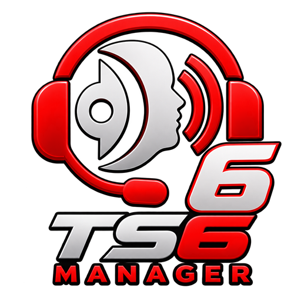
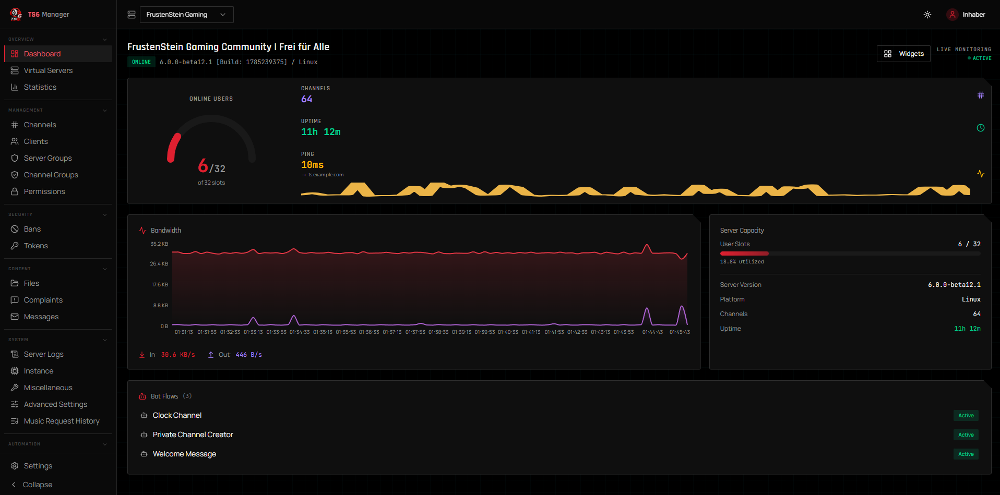
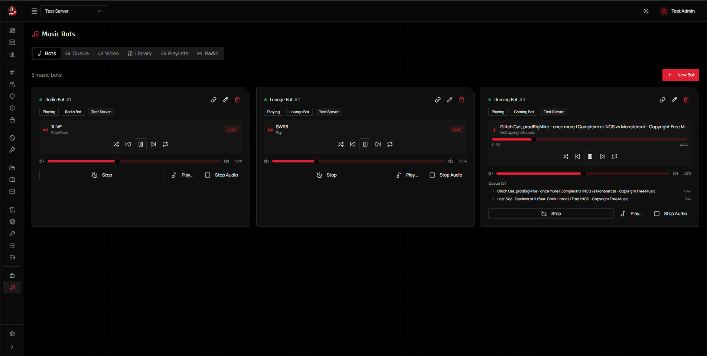
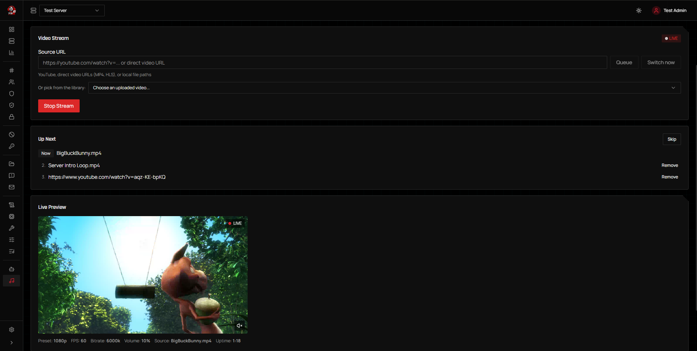
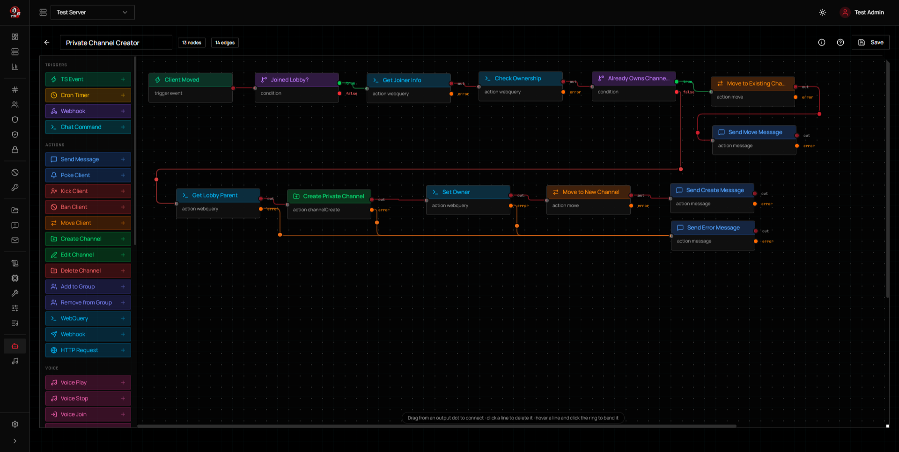
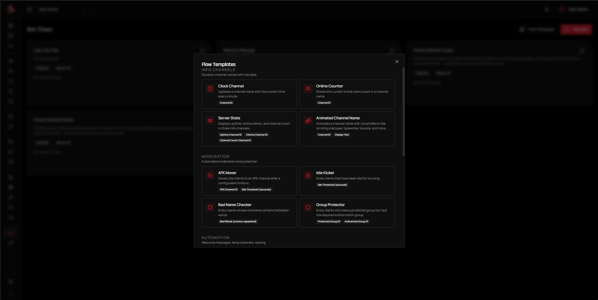
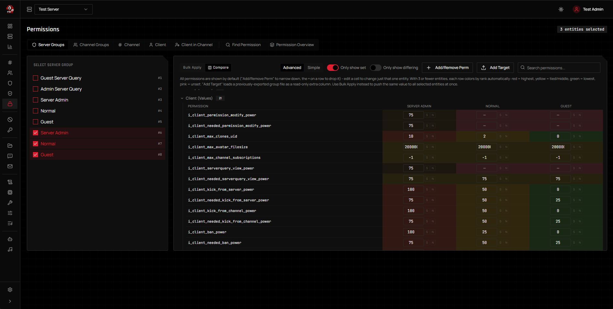

#### DISCLAIMER: 

This is a fork of clusterzx/ts6-manager



# TS6 Manager

Web-based management interface for TeamSpeak servers. Control virtual servers, channels, clients, permissions, music bots, automated workflows, and embeddable server widgets — all from your browser.

Built on the **WebQuery HTTP API** (the ServerQuery replacement in modern TeamSpeak builds). Telnet is not used or supported.


## Screenshots

<details>
<summary><b>Dashboard, music bots, video streaming, the visual bot flow editor, ready-made flow templates, and the permission editor</b> — click to expand</summary>

### Dashboard
Live overview of your server: online users, channel count, uptime, ping, bandwidth graph, and server capacity at a glance. The bandwidth and ping charts always show the last 20 minutes the moment you open the page — the backend measures every running virtual server continuously and keeps the history in its database, so it is there even right after a restart rather than building up while you watch (for anything longer, the History tab on the Statistics page keeps bandwidth and ping for up to a month). Below the live user count, a card charts the number of users over the last 24 hours (weekends marked, unreachable and stopped periods shown instead of a false zero), visible to every role that can see the server.



### Music Bots
Run multiple music bots per server. Each bot has its own queue, volume control, and playback state. Supports radio streams, YouTube, and a local music library. Users in the bot's channel can control it via text commands (`!radio`, `!play`, `!vol`, etc.). A bot can also be configured to autoplay a chosen song or radio station on its own every time it connects, so it's never left sitting idle after a manual start, a server restart, or a reconnect. A bot can also pause itself when it has been alone in its channel for a number of minutes you set (per bot, off by default) and carry on when somebody comes back — a radio station is tuned in again, a track continues where it stopped; other bots and ServerQuery clients don't count as company, and a pause you made yourself is left alone. A bot that can't reach the server says so on its card - connecting, waiting for the next of up to 10 automatic retries (with a countdown), or stopped for good - together with the server's own reason (banned, flood protection, wrong password, server full, unreachable host, ...); a failed **Start** shows the same reason instead of a generic error. After the 10th failed retry, or at once for a real ban, a wrong server password or a full server, the bot stays stopped until you press **Start**. Each bot's TeamSpeak unique ID (UID) is shown, with a copy button, in its settings dialog - the ID to use for server group assignments, permissions or ban exceptions on the server.



### Video Streaming
Stream YouTube, Twitch, a direct URL or a video from your library into a TeamSpeak channel over WebRTC. Queue what plays next, watch a live preview in the browser, and see who is currently watching. Quality and volume default to values you set once under Settings → Streaming, where you can also let a stream end by itself after nobody has watched it for a number of minutes (off by default).



### Bot Flow Engine
Visual node-based editor for building automated server workflows. Drag triggers, conditions, and actions onto the canvas, connect them, and deploy. Supports TS3 events, cron schedules, webhooks, and chat commands as triggers.



### Flow Templates
Get started quickly with pre-built flow templates. Covers common use cases like temporary channel creation, AFK movers, idle kickers, online counters, and group protection. One click to import, then customize to your needs.



### Permissions
Edit permissions across all five layers, for online and offline clients alike. Set many permissions to the same value in one step, import a previously exported group file onto anything you have selected, compare several entities side by side with the differences highlighted automatically, look up where a permission is set anywhere on the server, and see every permission that applies to one client in one channel together with the layer it comes from. Admins can also add or remove permissions on every regular server group of one type (Server Admin, Server Normal and so on) in one step, instance-wide, after a confirmation. A server or channel group's icon shows up as a real preview wherever the group is listed or picked, and its underlying `i_icon_id` permission has its own visual picker instead of typing a raw icon ID.



</details>

## Why This Fork Exists

Upstream had a persistent video/audio streaming stutter that was never resolved, plus a pile of security findings nobody had triaged. This fork root-caused and fixed the streaming stutter, did a full security-hardening pass, and has since grown a considerable number of its own features and upstream-requested fixes on top.

**See [CHANGELOG.md](CHANGELOG.md)** for the full history — a short summary of the headline changes, followed by every individual change in the order it shipped.

## Requirements

**On your machine:**

- **Docker** with the Compose plugin — that's all. ffmpeg, yt-dlp and everything else the backend needs is already baked into the images

**On your TeamSpeak server** — which does not have to be the same machine:

- **WebQuery HTTP enabled** (not raw/telnet). It is off by default on TeamSpeak 6, and how you enable it depends on how your server runs: `query_protocols` has to include `http`, set either in `tsserver.yaml`, as a command-line flag, or — for the official Docker image — via `TSSERVER_QUERY_HTTP_ENABLED=1`. If you rent your server, your host may have to enable it for you
- **A WebQuery API key.** Your server prints a `serveradmin` key once, on its first-ever startup; otherwise generate one with `apikeyadd`. The key is optional: if you rent a server and your host gives out no WebQuery access, add the connection without one — the music bots (which only need the host and the voice port) work on it, and the pages that need WebQuery are hidden while that connection is selected
- **Network access to the query port** (`query_http_port`, default `10080`) from wherever this manager runs, and the server's query IP allowlist has to include the address it connects from. TeamSpeak's own documentation explicitly recommends adding a web administration interface's IP there. If the two run on separate machines that means the manager's outbound address — and you should restrict who can reach that port rather than exposing it openly. See [Getting Started](https://github.com/DomeNinchen/ts6forkmanager/wiki/Getting-Started)

**Only if you want the matching feature:**

- **SSH ServerQuery** on your TeamSpeak server — needed exclusively for bot flows triggered by server events (a client joining, leaving, moving). Everything else, including scheduled and webhook-triggered flows, runs over WebQuery alone
- **UDP `50000-50100` open on the host** — needed exclusively for video streaming. That traffic cannot pass through an HTTP reverse proxy and needs its own firewall rule

## Quick Start (Docker)

1. Clone the repository — the images are built from source, so the compose file alone is not enough:

```bash
git clone https://github.com/DomeNinchen/ts6forkmanager.git
cd ts6forkmanager
```

2. Create a `.env` file in the repository root:

```env
JWT_SECRET=your-random-secret-at-least-32-characters
ENCRYPTION_KEY=another-random-secret-for-credential-encryption
```

Generate secure values:

```bash
echo "JWT_SECRET=$(openssl rand -base64 32)" >> .env
echo "ENCRYPTION_KEY=$(openssl rand -base64 32)" >> .env
```

3. Create the shared Docker network — once per host. The compose file attaches to it as an *external* network, so Compose won't create it for you and the first start fails without it:

```bash
docker network create ts6-network
```

4. Build and start the stack. The first build takes a few minutes, since it compiles the Go sidecar and both Node apps:

```bash
docker compose up -d --build
```

5. Open `http://localhost:3000/setup` and create your admin account
6. Log in, then add your TeamSpeak server connection under **Settings → Connections** (host, WebQuery port, API key — the key may stay empty, see above)

> `JWT_SECRET` is **required** — the backend will refuse to start in production without it.
> `ENCRYPTION_KEY` is optional but recommended — if not set, `JWT_SECRET` is used as fallback for credential encryption.

Running it behind a reverse proxy, or on Coolify? See [Deployment](https://github.com/DomeNinchen/ts6forkmanager/wiki/Deployment). Every other environment variable is listed in [Configuration](https://github.com/DomeNinchen/ts6forkmanager/wiki/Configuration).

> **Visitor address behind a proxy:** the backend learns who is connecting from the `X-Forwarded-For` header and believes it only as far as `TRUST_PROXY` says — the number of reverse proxies in front of it (`1`, the frontend container's nginx alone, by default; `2` with a host nginx or Coolify's proxy in front of that), or a comma-separated list of proxy addresses. Too low and every visitor appears as your proxy (the sign-in rate limit is then shared by everybody); too high and an address the visitor wrote himself is believed. **Settings → Network** shows how a request reached the backend, which address it takes for you and which number fits. The backend port `3001` is published on `127.0.0.1` only; open it to the network and anybody can forge that header. The same address decides whom an [IP ban](#features) turns away, so a wrong `TRUST_PROXY` makes bans miss the visitor (or hit the proxy - which is why private addresses cannot be banned). If you ever ban the address you come in from, set `IP_BANS_DISABLED=true` and restart the backend, lift the ban, and unset it again.

## Features

**Server management** — dashboard with live stats and a 20-minute bandwidth and ping history, a statistics page whose History tab charts the number of users, the bandwidth (download and upload, with their peaks) and the ping of each virtual server for a day up to a month (recorded by the backend around the clock and kept across restarts, with a 24-hour average, weekends marked, an optional slot-limit line on the user chart, and unreachable or stopped periods - and, for the ping, timeouts - shown instead of a false zero; the last 24 hours of the user count also appear as a card on the dashboard), virtual server control, channel tree with drag-and-drop, client list with bulk actions, client database (every profile the server has ever seen, loaded in blocks and searchable by nickname, unique ID, database ID, custom info or channel group, with banning, deleting, banned profiles highlighted, a group mode that switches server group membership right in the list, selectable columns, and export to CSV, HTML or JSON), bans, complaints, offline messages (the inbox of the query account the manager is connected with, not a server-wide list: each message shows who it is from by nickname, or by unique ID where the client database no longer knows the sender, and its text when opened; compose and delete), file browser (create folders, upload files and whole folders through an upload window (choose them or drop them on the list, look them over, then start; a folder keeps its structure, empty folders included when it is dropped; a name with umlauts or other non-ASCII characters is flagged there, because TeamSpeak clients may not be able to download such a file, with the choice of uploading it under a plain ASCII name or as it is - for a folder the choice covers everything in it) with a progress panel that keeps running while you use other pages, download (a folder comes as one ZIP, packed while it downloads), preview pictures (PNG, JPEG, GIF, BMP and WebP up to 10 MB, recognised by their bytes and not by their name, with the arrow keys through the folder), move between channels, delete; the largest upload is set with `FILES_MAX_UPLOAD_MB`, 100 MB by default), icon browser (view, upload and delete a server's icon pool, with search and where each icon is currently in use; a channel's icon is chosen from that pool in the channel's edit dialog), log viewer, snapshots, and per-server advanced settings.

**Query console** — for admins, a console for any ServerQuery command, run over the server's normal WebQuery connection. It completes command names (including the few the server's own help leaves out) and the names of the properties the `*edit` commands accept, shows each command's parameters (required, optional, repeatable, value ranges, fixed values) and, with Ctrl+Space, offers the server's own channels, clients, groups and permissions for an id. Results come back as tables with a click-to-explain for ids, flags, times and sizes, or as raw ServerQuery text; secrets in them stay hidden until revealed. The same input line can send a chat message to the server, a channel or one client, and the history behind the arrow keys stays in the browser (a command carrying a password is never kept). Commands that destroy data or can lock the app out (`permreset`, `serverprocessstop`, `channeldelete`, `apikeydel` and others) only run after their name has been typed to confirm, which the backend checks itself. Every command sent is recorded with who ran it, passwords and keys masked, and those that change something also leave a line in the TeamSpeak server log. The console stays under half of the server's query flood limit, because exceeding it gets the address of the whole app blocked. `use`, `help` and the event subscriptions (`servernotifyregister`, `servernotifyunregister`) are the console's own; what WebQuery does not offer (`login`, `quit`, `ft*`) is not available.

**Live events** — the console can also listen to what happens on a virtual server: clients joining, leaving and moving, server settings changed, channels created, edited, moved or deleted, chat in the server, in one channel or privately, and bans added or removed. The categories are ticked in the console's *Events* panel or typed the ServerQuery way (`servernotifyregister event=server`, `servernotifyunregister`). Events appear in the transcript as they arrive, each one expandable to every field TeamSpeak sent (a click on an id names the channel, client or group behind it), and what has been collected can be saved as a text or JSON file; nothing is stored on the server. WebQuery can not register for events, so this needs the SSH credentials of the server connection. All admins listening to one virtual server share a single SSH query session of the backend (a session of its own, not the bots'); each of them is only sent the categories they asked for, and the backend closes the session a minute after the last one has stopped. TeamSpeak delivers the chat of the channel the listener sits in, so one virtual server can have only one channel's chat listened to at a time. Listening is recorded in the console's audit trail (who, which categories, and for how long), the backend re-checks every minute that the account is still an admin, and it keeps the listener's commands under the same share of the query flood limit as the rest of the console.

**Connection journal** — for admins, a journal of who signed in to the web interface and who joined a TeamSpeak server. On the web side it records every password sign-in, second-factor step and single sign-on, successful or not, with the time, the address it came from, the account (for a name that no account has, what was typed), the browser and the reason it failed (wrong password, no such account, disabled account, wrong second-factor code, sign-in limit reached, ...). On the TeamSpeak side one row per client connection: nickname, unique ID, address, client version and platform, which connection and virtual server, when it joined and when it left with TeamSpeak's own reason. A connection with an SSH login is listened to live and nothing is missed, however short the visit; without one the server is asked every 15 seconds, which misses a visit shorter than that and cannot say why a client left. A refused connection (a banned client, flood protection) leaves no trace on the server and so cannot appear. ServerQuery clients and this app's own music bots are left out unless the page's switches say otherwise, and each connection has a *Record who joins* switch of its own. The list is sorted and filtered on the server by period, source, event, result, server connection, account, nickname, unique ID or address (a click on an address narrows it to that address), can show just the clients that are on a server right now, is paged, and is also available as one line per address with the entries, failures, successes and the number of accounts tried. The page's *Settings* tab shows how each TeamSpeak server is covered (live events, polling, or why not). It is kept 30 days and at most 100 000 entries by default, both set there, where recording can be switched off and the journal emptied. The address on the web side is the one the backend works out from the proxy chain in front of it (see `TRUST_PROXY`). Every address gets a country (with the City database also region and city), looked up offline in a database file on the server: the page's *Settings* tab downloads DB-IP's free Country database (about 4 MB) or the City one (about 60 MB) on a click, optionally refreshes it every month (off by default), or takes a file of your own (a MaxMind GeoLite2 file, say); entries written before the database was installed are looked up afterwards. Both lists have a country column and a country filter, and the page credits DB-IP as the licence (CC BY 4.0) asks. Any address can be banned from the journal with one click, on the web interface, on a TeamSpeak server, or both: a web ban answers every request from the address with 403 (the whole API and the WebSocket, only `/api/health` stays open; open sockets of it are closed) for the time chosen in the dialog - an hour, a day, a week, 30 days or until lifted - and the *Bans* tab lists the bans in force, what each has turned away, and lifts them; a TeamSpeak ban is a rule for exactly that address (IPv6 as well, never a range) on one virtual server or on all of a connection's, kept in the server's own ban list and lifted on the Bans page. Rows show whether the web interface turns their address away and whether a TeamSpeak ban covers the client (by address, unique ID or nickname). To keep an admin from locking themselves out, the address a request comes from, this machine and private networks cannot be banned, an address an admin signed in from in the last week needs a second confirmation, and `IP_BANS_DISABLED=true` in the environment switches the web bans off from outside the interface.

**Permissions** — a full editor across all five permission layers, including offline clients. Bulk-apply to many entities at once (the rows show the value the selection shares, or "mixed" where it differs, so a permission can be taken away from all of them in one go), set many permissions to one value in a single step, import an exported group file onto the current selection (merging into it or replacing it outright), compare several side by side with automatic highlighting, look up where a permission is set anywhere on the server, and see every permission that applies to one client in one channel with the layer it comes from. Admins can add or remove permissions on all regular server groups of one type at once (instance-wide, behind a confirmation). A group's `i_icon_id` permission has its own preview and a visual picker over the server's icon pool, instead of a bare number. → [Wiki](https://github.com/DomeNinchen/ts6forkmanager/wiki/Permissions)

**Groups** — server and channel group management with member handling, bulk selection, and export/import between servers. Each group's actual icon is shown wherever it's listed or picked, not just a generic type glyph. → [Wiki](https://github.com/DomeNinchen/ts6forkmanager/wiki/Server-and-Channel-Groups)

**Music bots** — multiple bots per server with independent queues, radio streaming, YouTube (via yt-dlp) and Spotify links, a media library with playlists, and in-channel text commands whose access can be restricted per command to chosen server groups, with an admin bypass. → [Wiki](https://github.com/DomeNinchen/ts6forkmanager/wiki/Music-Bots)

**Video streaming** — WebRTC streaming from YouTube, Twitch, direct URLs or your library into a TeamSpeak channel, with a queue, configurable quality defaults, an in-browser preview and a live viewer list.

**Bot flows** — a visual editor for automation. Triggers from TeamSpeak events, cron schedules, webhooks and chat commands; actions covering kick/ban/move/message, channel management, HTTP requests and WebQuery commands; plus conditions, variables, loops and a placeholder system. Ships with ready-made templates. → [Wiki](https://github.com/DomeNinchen/ts6forkmanager/wiki/Bot-Flows)

**Server widgets** — embeddable status banners for websites and forums, as a live page, SVG or PNG, with public token-based access. → [Wiki](https://github.com/DomeNinchen/ts6forkmanager/wiki/Widgets)

**Security** — role-based access control with four roles and per-server scoping, two-factor authentication with recovery codes, Single Sign-On via any OpenID Connect provider, AES-256-GCM encryption for stored credentials, JWT with refresh-token rotation, SSRF protection, and rate limiting. → [Wiki](https://github.com/DomeNinchen/ts6forkmanager/wiki/Users-and-Roles)

**Privacy** — the web interface loads nothing from a third party (its fonts are bundled and served from the app's own origin), the application sets no HTTP cookies, and the browser only keeps what the interface needs to work. A dismissible storage notice says so on the login page and in the app; admins switch it off in Settings → WebGui. It is informational, not a consent gate. What exactly is stored and loaded is listed [below](#privacy-what-the-app-stores-and-loads). → [Wiki](https://github.com/DomeNinchen/ts6forkmanager/wiki/Privacy-and-Hosting)

**Theming** — nine base themes, six dark (Command Deck, OLED-Black, Graphite, Carbon, Frost, Deep Forest) and three light (Daylight, Paper, Frost Light), combinable with any of ten accent colours. The admin sets an installation-wide default; every user can override both for themselves in their own browser. → [Wiki](https://github.com/DomeNinchen/ts6forkmanager/wiki/Themes-and-Appearance)

**Language** — the interface is available in English, German and French, with more added as the community translates them on [Crowdin](https://crowdin.com/project/ts6forkmanager). Pick one in Settings → WebGui and it's remembered on your account across devices; before logging in, the login and setup screens instead follow your browser's own language automatically. Want to help translate? Join the project on Crowdin - no code changes needed, new/updated translations land in this repo on their own.

**Administration** — user and session management, yt-dlp cookie handling, runtime debug toggles, scheduled restarts, and an update status page. → [Wiki](https://github.com/DomeNinchen/ts6forkmanager/wiki/Administration)

## Privacy: What the App Stores and Loads

This is a description of what the software does, not legal advice. Every installation is run by its own admin, who decides what a visitor has to be told; the defaults are meant to leave as little behind as possible.

**Loaded.** A visitor's browser talks only to the server the app runs on. The fonts (Manrope, JetBrains Mono, Rajdhani, SIL Open Font License 1.1, text in `/fonts-LICENSE.txt`) are bundled and served from the same origin, and the Content-Security-Policy of the frontend container allows no external script, style, font or `connect` source. Separate from that, the *server* contacts what an admin configures or uses: TeamSpeak servers, an OpenID Connect provider, GitHub for the update check, YouTube through yt-dlp, and the URLs in bot flows.

**Cookies.** The application sets no HTTP cookies. The only "cookie" in the code is the optional YouTube cookie file for yt-dlp, which has nothing to do with visitors.

**Browser storage.** Everything else is `localStorage` in the visitor's own browser, never `sessionStorage` or IndexedDB, and all of it is functional:

| Key | Holds |
|---|---|
| `ts6-auth` | the login session: access and refresh token and the user's profile |
| `ts6-server` | the selected server and virtual server |
| `ts6-ui` | display state: personal theme and accent, sidebar and collapsed sections |
| `ts6-language` | the interface language (also the fallback before logging in) |
| `ts6-privacy-notice` | whether the storage notice was dismissed |
| `ts6-update-banner`, `ts6-yt-cookie-banner` | which update and YouTube-cookie notices were dismissed |
| `ts6-client-database` | the Client Database page's columns and hidden groups |
| `ts6-flow-editor-help-seen` | that the Bot Flow editor's usage dialog is not to be shown again |
| `ts6-history-timezone`, `ts6-history-show-slots`, `ts6-history-metric` | display choices of the statistics History tab |
| `ts6-2fa-device-<username>` | the "remember this device" token for two-factor login |
| `ts6-console-events-<id>`, `ts6-console-history-<id>` | the Query console's chosen event categories and its command history, one pair per user account (a command carrying a password is never kept) |

The public widget page (`/widget/<token>`), which is meant to sit in an iframe on other sites, stores nothing at all and does not show the storage notice.

**Server side: the connection journal.** The backend writes a row to its database for every sign-in event at the web interface (password step, second factor, single sign-on, and requests the sign-in limit turned away): time, event, result, reason, the IP address the backend takes for the visitor, the account name, and the browser's `User-Agent`. For a name that no account has, the name is stored as it was typed - which can be a password entered in the wrong field, so treat the journal like the sensitive data it is. For every client that joins a TeamSpeak server with recording switched on (the default, per connection) it also stores the nickname, unique ID, IP address, client version and platform, the server connection and virtual server, and when the client joined and left, read from the TeamSpeak server over its SSH ServerQuery login (live events) or WebQuery (a poll every 15 seconds). Only admins can read it. By default it keeps 30 days and at most 100 000 rows and prunes every hour; **Connection Journal → Settings** changes both, switches recording off, and empties it. The country of an address is looked up locally in a database file (DB-IP Lite, CC BY 4.0, or a file an admin uploaded) and stored with the row; no address is sent anywhere. The one outbound request is fetching that file from `download.db-ip.com` when an admin clicks *Download* (or, if switched on, for the monthly update), which carries nothing about the installation. Otherwise nothing is sent anywhere. IP addresses count as personal data in many places - how long to keep them is your decision, and this is not legal advice.

## 📖 Documentation

**The [Wiki](https://github.com/DomeNinchen/ts6forkmanager/wiki) is the full documentation** — how to use each feature, how to configure and deploy it, and the things that are easy to get wrong.

| | |
|---|---|
| [Getting Started](https://github.com/DomeNinchen/ts6forkmanager/wiki/Getting-Started) | Connecting your TeamSpeak server, and what WebQuery vs. SSH is actually for |
| [Permissions](https://github.com/DomeNinchen/ts6forkmanager/wiki/Permissions) | The five layers, which one wins, and the tools for working with them |
| [Tips and Pitfalls](https://github.com/DomeNinchen/ts6forkmanager/wiki/Tips-and-Pitfalls) | Behaviour that looks like a bug but isn't. Worth reading early |
| [Configuration](https://github.com/DomeNinchen/ts6forkmanager/wiki/Configuration) | Every environment variable, for backend and sidecar |
| [Deployment](https://github.com/DomeNinchen/ts6forkmanager/wiki/Deployment) | Reverse proxies, Coolify, backups |
| [Privacy and Hosting](https://github.com/DomeNinchen/ts6forkmanager/wiki/Privacy-and-Hosting) | What the app stores and loads, and what a host should think about (no legal advice) |
| [Development](https://github.com/DomeNinchen/ts6forkmanager/wiki/Development) | Architecture, tech stack, running it from source |

## Known Issues (Upstream TS6 Server Bug)

- **Music bot avatar only visible to TS6 clients, not TS3** ([teamspeak/teamspeak6-server#122](https://github.com/teamspeak/teamspeak6-server/issues/122)): an avatar uploaded while connected shows correctly to other TS6 clients, but a TS3 client viewing the same connection gets stuck on "Loading Image" forever. Confirmed this is server-side, not about which client (or bot) does the uploading, with a real, isolated test against a real TS6 server — including a control test using the *official TS6 client itself* (not just this fork's code): the *same* official TS6 client produces a TS3-compatible avatar when connected to an (old) TS3 server, but not when connected to a TS6 server. Matches TeamSpeak's own previously-reported [avatar "convert error"](https://community.teamspeak.com/t/avatar-cannot-be-set-convert-error/60941) thread. Can't be fixed from this fork's side; needs a TeamSpeak server fix.

The music bot description template was affected by a similar-looking issue (`clientupdate client_description=...` rejected outright) — turned out to be this fork using the wrong ServerQuery command rather than a TS6 bug: `client_description` is only documented as a `clientedit` (ServerQuery, edit-from-outside) parameter, not a `clientupdate` (self, over the bot's own voice connection) one. Fixed by pushing the description via `clientedit` over the existing WebQuery connection instead.

## License

GPLv3
